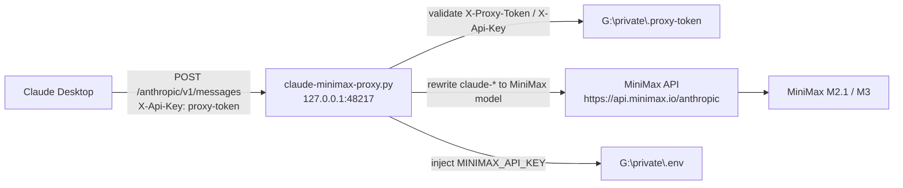
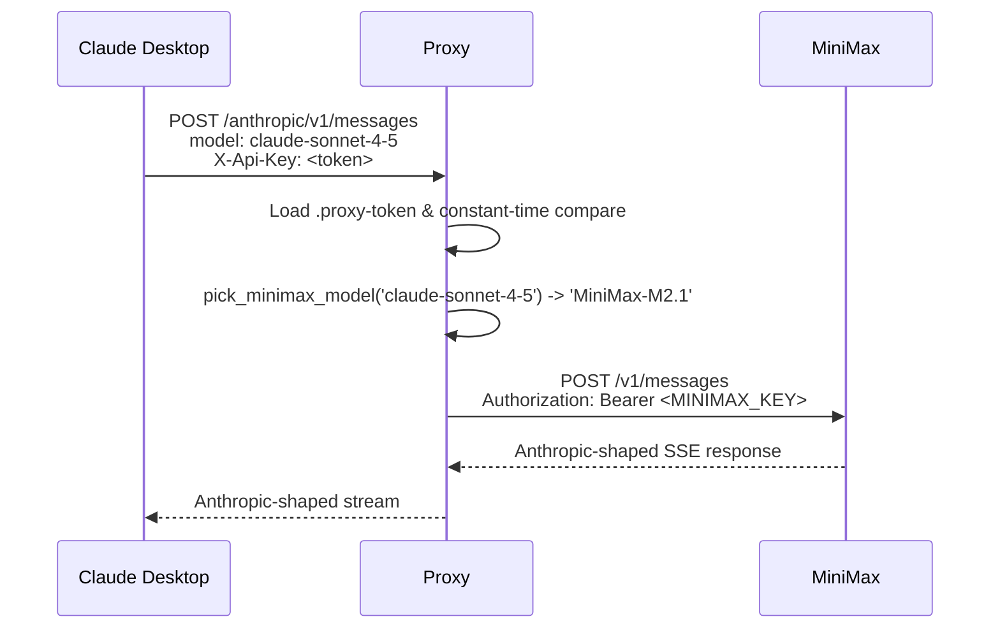
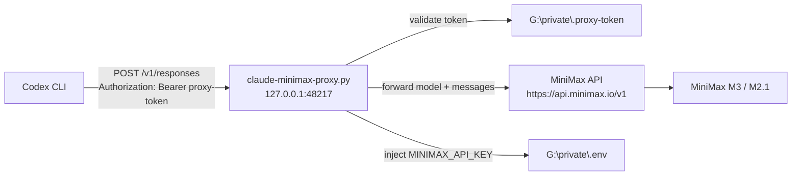
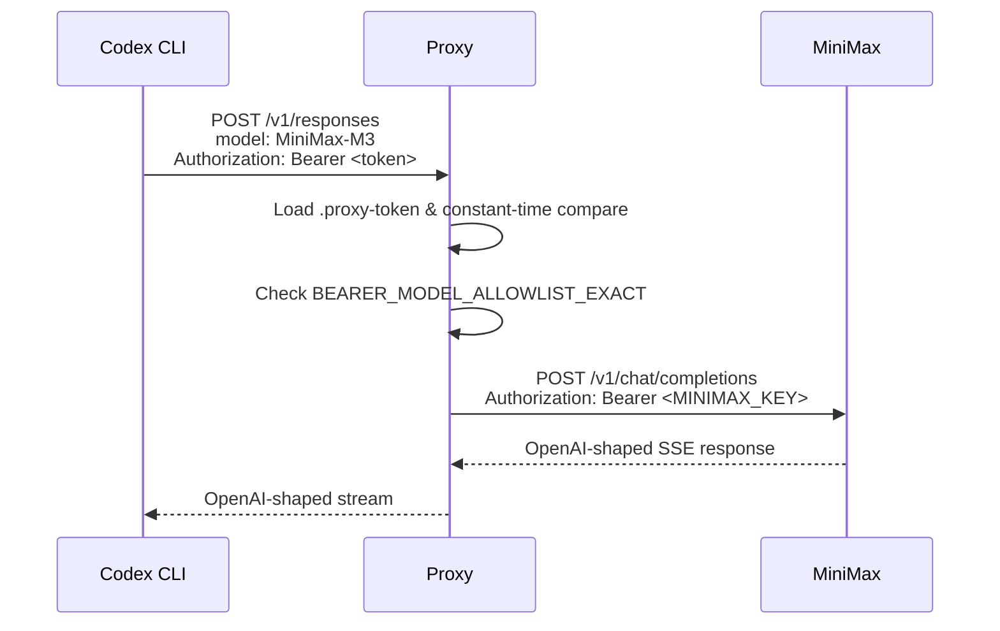
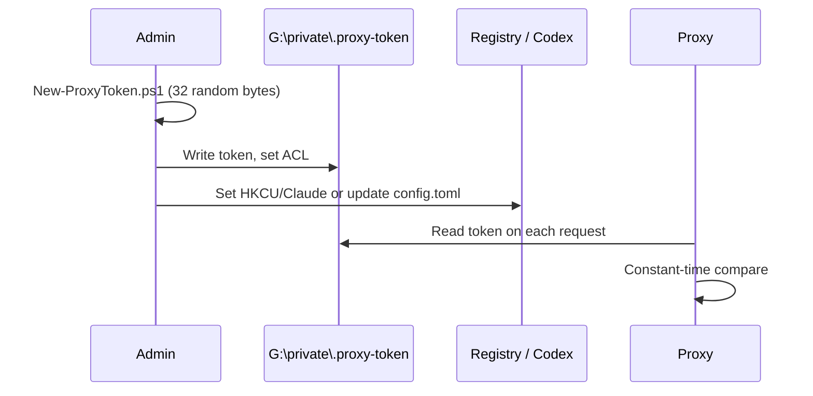

> HISTORICAL DOCUMENT — superseded by README.md and docs/SAFETY_REVIEW.md.
> Do not run old watchdog, permission-bypass, process-kill or repair instructions.

# Claude Desktop ↔ MiniMax and Codex ↔ MiniMax Gateway E2E Blueprint

## 1. Purpose

This blueprint describes the complete end-to-end flow for two clients using the local `claude-minimax-proxy.py` gateway to reach MiniMax models:

- **Claude Desktop** via its third-party gateway registry settings.
- **ChatGPT Codex (CLI)** via a custom `model_providers` entry in `~/.codex/config.toml`.

Both flows share the same proxy, the same `.proxy-token` secret, and the same `MINIMAX_API_KEY` from `.env`, but they use different wire protocols because each client speaks a different API surface.

---

## 2. Core Components

| Component | Path / Location | Purpose |
|-----------|----------------|---------|
| Proxy | `G:\Github\claude-codex-devin\claude-minimax-proxy.py` | Translates client requests to MiniMax's Anthropic- and OpenAI-compatible endpoints. |
| Proxy token | `G:\private\.proxy-token` | Shared secret that both clients must present. |
| MiniMax API key | `G:\private\.env` | Upstream secret; never leaves the proxy. |
| Claude Desktop config | `HKCU:\SOFTWARE\Policies\Claude` | Registry overrides for provider, base URL, API key, and auth scheme. |
| Codex config | `C:\Users\Admin\.codex\config.toml` | User-level `model`, `model_provider`, and `[model_providers]` table. |

---

## 3. Security Model

1. **Fail-closed**: If `G:\private\.proxy-token` is missing or unreadable, the proxy returns `401` for every protected path.
2. **Constant-time compare**: Proxy-token validation is length-checked and then bitwise XOR compared to avoid timing attacks.
3. **Client auth discarded**: The proxy never forwards `X-Api-Key`, `X-Proxy-Token`, or `Authorization: Bearer <proxy-token>` to MiniMax. It injects the real `MINIMAX_API_KEY` from `.env` for upstream calls.
4. **ACL**: `.proxy-token` is owned by the current user + `SYSTEM` only; `Everyone` is explicitly denied.

---

## 4. Claude Desktop Flow

Claude Desktop's built-in *third-party gateway* feature can only emit the configured gateway key as `X-Api-Key` or `Authorization: Bearer`. The proxy has been patched to accept all three forms (`X-Proxy-Token`, `X-Api-Key`, `Authorization: Bearer`).

### 4.1 Registry Settings

```powershell
Set-ItemProperty -Path 'HKCU:\SOFTWARE\Policies\Claude' -Name 'inferenceProvider' -Value 'gateway'
Set-ItemProperty -Path 'HKCU:\SOFTWARE\Policies\Claude' -Name 'inferenceGatewayBaseUrl' -Value 'http://127.0.0.1:48217/anthropic'
Set-ItemProperty -Path 'HKCU:\SOFTWARE\Policies\Claude' -Name 'inferenceGatewayApiKey' -Value $token
Set-ItemProperty -Path 'HKCU:\SOFTWARE\Policies\Claude' -Name 'inferenceGatewayAuthScheme' -Value 'x-api-key'
```

### 4.2 Architecture



### 4.3 Sequence



---

## 5. ChatGPT Codex Flow

Codex uses the OpenAI *Chat Completions* wire protocol for custom providers. The proxy exposes `/v1/chat/completions` and forwards to `https://api.minimax.io/v1/chat/completions` after verifying the proxy token. The proxy token is read on demand by a configured `auth.command`.

### 5.1 Codex config.toml

```toml
model = "MiniMax-M3"
model_provider = "minimax_gateway"

[model_providers.minimax_gateway]
name = "MiniMax via local Claude gateway"
base_url = "http://127.0.0.1:48217/v1"
wire_api = "responses"

[model_providers.minimax_gateway.auth]
command = "powershell"
args = ["-NoProfile", "-Command", "Get-Content -LiteralPath 'G:/private/.proxy-token' -Raw"]
timeout_ms = 5000
refresh_interval_ms = 0
```

### 5.2 Architecture



### 5.3 Sequence



---

## 6. Model Mapping

### 6.1 Anthropic / Claude Desktop

Claude Desktop sends Anthropic-style picker names. The proxy rewrites them to MiniMax models:

| Claude Desktop request model | Rewritten MiniMax model |
|-----------------------------|--------------------------|
| `claude-sonnet-4-5` | `MiniMax-M2.1` |
| `claude-opus-4-5` | `MiniMax-M3` |
| `claude-haiku-4-5` | `MiniMax-M2.1` |

### 6.2 Codex

Codex must send exact MiniMax model IDs because the OpenAI-compatible endpoint uses `BEARER_MODEL_ALLOWLIST_EXACT`:

| Codex `model` | Allowed by proxy | Notes |
|---------------|------------------|-------|
| `MiniMax-M3` | Yes | Frontier text / multimodal |
| `MiniMax-M2.1` | Yes | Fast general-purpose |
| `MiniMax-M2.7` | Yes | Higher reasoning |
| `image-01` | Yes | Image generation |
| `speech-02-hd` | Yes | TTS |

---

## 7. Token Lifecycle



---

## 8. Verification Commands

### 8.1 Verify proxy token and registry

```powershell
powershell -NoProfile -File G:\Github\claude-codex-devin\scripts\Repair-MinimaxGateway.ps1
```

Expected final output includes `STATUS=200` and a MiniMax response body.

### 8.2 Verify Codex gateway directly

```powershell
$token = (Get-Content 'G:\private\.proxy-token' -Raw).Trim()
$body = '{"model":"MiniMax-M3","messages":[{"role":"user","content":"hi"}],"max_tokens":10}' | ConvertTo-Json -Compress
Invoke-WebRequest -Uri 'http://127.0.0.1:48217/v1/chat/completions' -Method POST -Headers @{'Authorization'="Bearer $token"; 'Content-Type'='application/json'} -Body $body -UseBasicParsing
```

### 8.3 Live Codex test

```bash
codex --model MiniMax-M3 --provider minimax_gateway "hello"
```

---

## 9. Troubleshooting

| Symptom | Root cause | Fix |
|---------|------------|-----|
| `missing or invalid X-Proxy-Token` (401) | Token missing/empty or wrong header | Re-run `Repair-MinimaxGateway.ps1` to regenerate token and ACL. |
| `PermissionDenied` reading `.proxy-token` | ACL contains `Deny Everyone` | `Repair-MinimaxGateway.ps1` removes stale rules and re-sets owner/SYSTEM allow. |
| Claude shows `auth_failed` | Registry points to wrong base URL or scheme | Verify `inferenceGatewayBaseUrl` ends in `/anthropic` and `inferenceGatewayAuthScheme` is `x-api-key`. |
| Codex `unknown model` or `unsupported model` | `model` not in proxy allowlist or not MiniMax ID | Use exact `MiniMax-*` model IDs and `wire_api = "responses"`. |
| `404 not found` from proxy | Codex called an unimplemented path or wrong wire API | The proxy now implements `/v1/responses`; ensure `wire_api = "responses"`. |

---

## 10. Future Upgrades

1. **~~Responses API translator~~** ✅ Done: proxy now translates `POST /v1/responses` to `POST /v1/chat/completions` and back.
2. **Vision / speech / video pipelines**: Reuse the OpenAI-compatible `/v1/image_generation` and TTS models through dedicated `model_providers` profiles.
3. **Auto-start / watchdog**: Convert `Start-ClaudeMiniMaxProxy.ps1` into a Windows Task Scheduler or `hp-mha-serena` governed runtime so the proxy starts with the user session.

---

## 11. Other clients with gateway support

The same OpenAI-compatible `http://127.0.0.1:48217/v1` endpoint works with any client that lets you override the base URL:

| Client | How to override base URL | Notes |
|---|---|---|
| **Claude Desktop** | Registry / policy key `inferenceGatewayBaseUrl` | Uses `POST /anthropic/v1/messages` with `X-Api-Key`. |
| **ChatGPT Codex** | `~/.codex/config.toml` `[model_providers.minimax_gateway]` | Uses `POST /v1/responses` with `Authorization: Bearer`. |
| **Continue.dev** | `~/.continue/config.json` `models[].apiBase` | Set `apiBase` to `http://127.0.0.1:48217/v1` and `apiKey` to the proxy token. |
| **Cline** | VS Code settings `cline.modelSettings.*.apiUrl` | Point the OpenAI-compatible provider at the proxy URL. |
| **Kilo Code** | Settings UI or `settings.json` `openai.baseUrl` | Same `http://127.0.0.1:48217/v1` endpoint. |

Devin and Windsurf do **not** expose a native gateway/base-URL override. If you want them to use the same MiniMax backend, you need to wrap them with a separate OpenAI-compatible proxy outside Devin.
