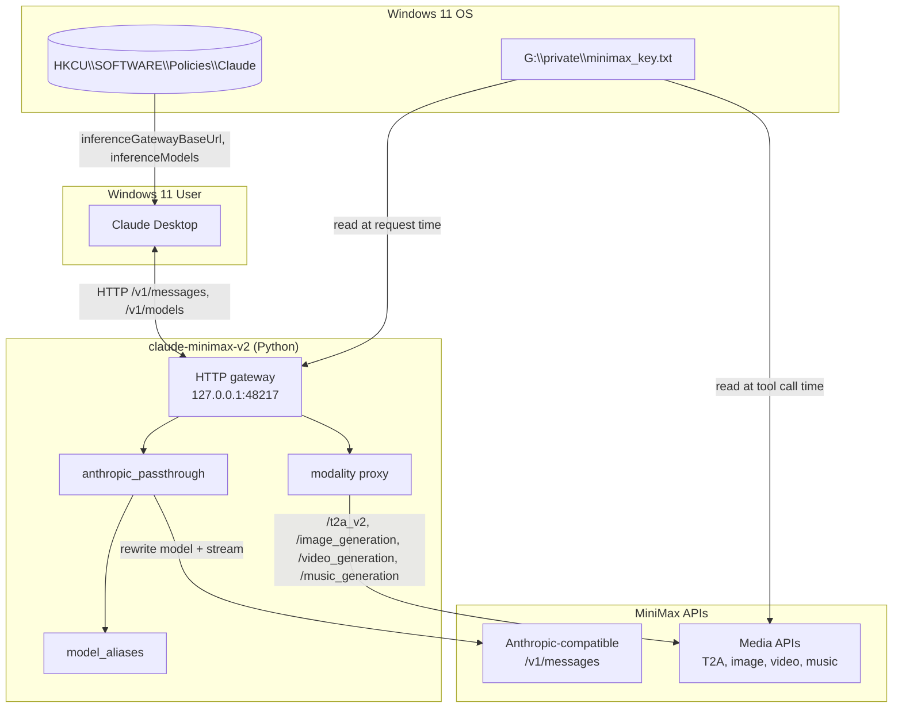
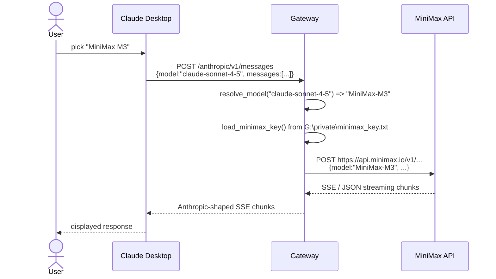
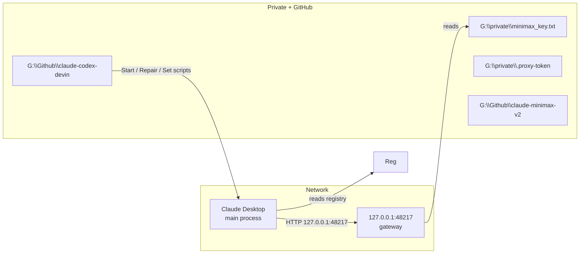

# Claude-Desktop MiniMax V2 — System Architecture

## 1. High-level block diagram

## 2. Component responsibilities

- **Claude Desktop**: Anthropic client that reads 3P gateway config from the Windows registry.
- **HKCU registry**: tells Claude where the gateway is and which model names to display.
- **claude-minimax-v2/gateway/server.py**: thin HTTP server that exposes `/anthropic/v1/messages` and `/v1/models` and a `/ui` playground.
- **anthropic_passthrough.py**: transparent proxy from Anthropic schema to MiniMax's Anthropic-compatible endpoint; rewrites model names.
- **model_aliases.py**: maps `claude-sonnet-*`, `claude-opus-*`, `claude-haiku-*` to `MiniMax-M3`, `MiniMax-M2.7`, `MiniMax-M2.7-highspeed`.
- **port_util.py**: binds to the preferred port `48217` or an ephemeral fallback; writes `.port` for the registry script.
- **Start-ClaudeMinimaxV2.ps1**: stops stale gateway, finds free port, starts `server.py`, writes `.port`, calls `Set-ClaudeDesktopGateway.ps1`.
- **Set-ClaudeDesktopGateway.ps1**: writes all HKCU values and the `managedMcpServers` list.
- **Repair-ClaudeMinimaxV2.ps1**: idempotent hard reset (stop, py_compile, clear `.port`, restart).

## 3. Data flow for one chat message

## 4. Port and file layout

