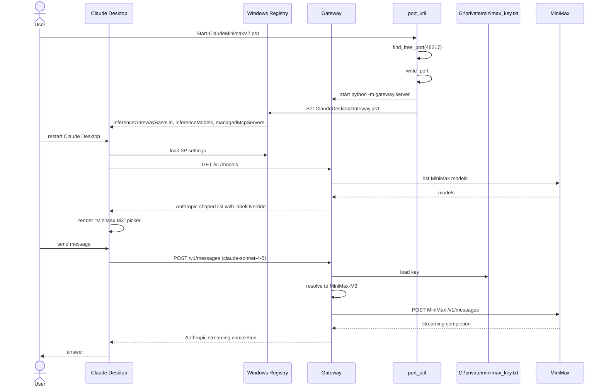

# Claude-Desktop MiniMax V2 — End-to-End Data Flow

## 1. Full E2E sequence



## 2. Registry key map

| Registry value | Purpose |
|---|---|
| `inferenceProvider` | `gateway` |
| `inferenceGatewayBaseUrl` | `http://127.0.0.1:<port>/anthropic` |
| `inferenceGatewayApiKey` | `proxy-managed` (ignored by proxy) |
| `inferenceGatewayAuthScheme` | `x-api-key` |
| `modelDiscoveryEnabled` | `true` |
| `inferenceModels` | JSON array of 6 Claude-family IDs with `labelOverride` |
| `managedMcpServers` | JSON array of stdio MCPs (minimax-media, hermes3d-locks, etc.) |
| `isLocalDevMcpEnabled` | `true` |

## 3. Model picker rewrite

```mermaid
flowchart LR
    CD["Claude Desktop model picker"]
    Reg["Registry inferenceModels"]
    GW["gateway /v1/models"]
    MM["MiniMax"]
    CD -->|displays| Reg
    Reg -->|labelOverride| CD
    CD -->|uses internal ID "claude-sonnet-4-5"| GW
    GW -->|resolve_model| MM
```
