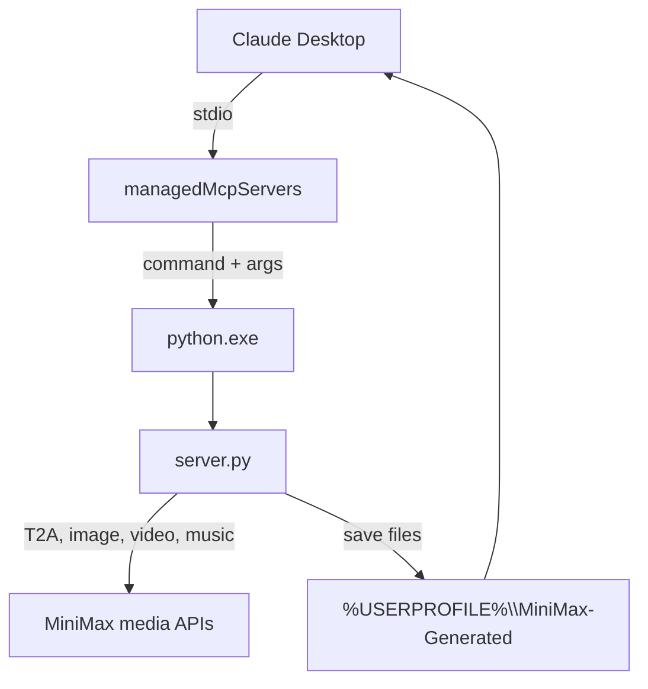

# Claude-Desktop MiniMax V2 — MiniMax Media MCP

## 1. What the media MCP does

The `minimax-media` MCP server (in `Testing-Claude-Minimax-Mcp/minimax-mcp-server`) exposes four tools to Claude Desktop:

- `minimax_generate_speech` — text-to-speech via MiniMax T2A
- `minimax_generate_image` — image generation via MiniMax image-01
- `minimax_generate_video` — video generation via MiniMax H3
- `minimax_generate_music` — music generation via MiniMax music-3.0

These are **not** the same as the Anthropic-compatible chat endpoint. They use separate `https://api.minimax.io/v1` REST APIs and use an `Authorization: Bearer <key>` header.

## 2. Wiring

## 3. Previous "transport closed" root cause

Claude Desktop was configured to start the MCP through `Start-MinimaxMediaMcp.ps1`, a PowerShell launcher. PowerShell over stdio does not cleanly forward the MCP JSON-RPC stream to the Python child; it consumes or mismatches pipeline input and the transport closes before `initialize` succeeds.

**Fix:** `Set-ClaudeDesktopGateway.ps1` now discovers a Python runtime with the `mcp` package and registers that `python.exe` plus the full path to `server.py` directly as `command`/`args`.

## 4. Current status

- The `server.py` responds correctly to JSON-RPC `initialize` and `tools/list`.
- The `mcp` package is installed and verified (`mcp==1.28.1`).
- Registry now uses direct `python.exe` + `server.py`.
- After restarting Claude Desktop, the `minimax-media` MCP should initialize.

## 5. Limitations

- Media tools are billed per generation and may require separate MiniMax quota.
- Generated files are saved to `%USERPROFILE%\MiniMax-Generated` by default.
- Video generation is asynchronous and can take several minutes; the tool polls for completion.
