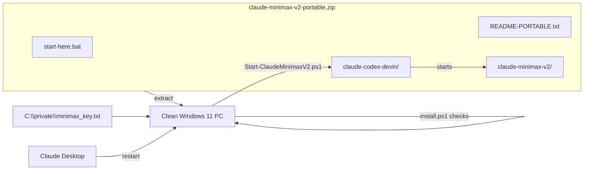
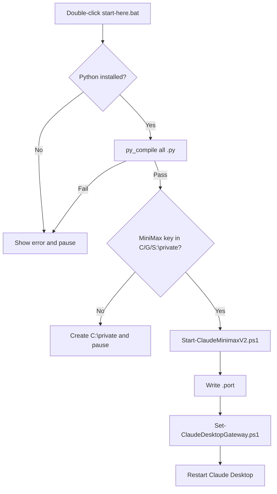

# Claude-Desktop MiniMax V2 — Portability Plan

## 1. Portable bundle layout

## 2. start-here.bat flow

## 3. Build script

- `claude-codex-devin\portable\Build-PortableZip.ps1`:
  1. Copies `claude-codex-devin` and `claude-minimax-v2` to temp.
  2. Excludes `.git`, `.venv`, `__pycache__`, `.hermes3d_orchestrator`.
  3. Generates top-level `start-here.bat` and `README-PORTABLE.txt`.
  4. Compresses to `G:\Github\claude-minimax-v2-portable.zip`.

## 4. Requirements on the target PC

- Windows 11
- Python 3.11+ on `PATH`
- MiniMax API key in `C:\private\minimax_key.txt` (or `G:\` / `S:\`)
- Claude Desktop installed
- No other claude-minimax-v2 gateway on the same port
