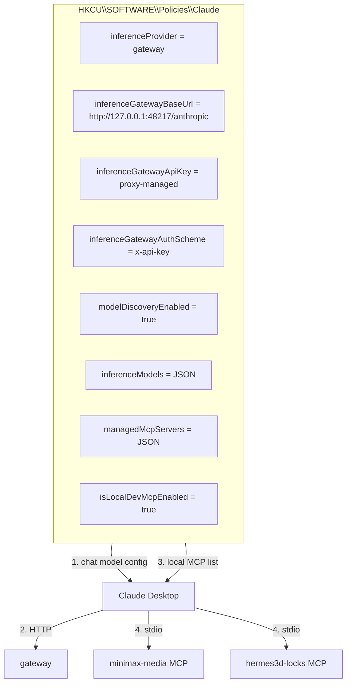

# Claude-Desktop MiniMax V2 — Registry Wiring

## 1. Registry path

```
HKCU:\SOFTWARE\Policies\Claude
```

All values are strings unless otherwise noted.

## 2. Visual wiring diagram



## 3. inferenceModels JSON shape

```json
[
  {
    "name": "claude-sonnet-4-5",
    "labelOverride": "MiniMax M3",
    "anthropicFamilyTier": "sonnet",
    "supports1m": true,
    "isFamilyDefault": true
  },
  {
    "name": "claude-opus-4-6",
    "labelOverride": "MiniMax M2.7",
    "anthropicFamilyTier": "opus",
    "isFamilyDefault": true
  },
  {
    "name": "claude-haiku-4-5",
    "labelOverride": "MiniMax M2.7 Highspeed",
    "anthropicFamilyTier": "haiku",
    "isFamilyDefault": true
  },
  {
    "name": "claude-sonnet-4",
    "labelOverride": "MiniMax M3 (legacy)",
    "anthropicFamilyTier": "sonnet",
    "supports1m": true
  },
  {
    "name": "claude-opus-4",
    "labelOverride": "MiniMax M2.7 (legacy)",
    "anthropicFamilyTier": "opus"
  },
  {
    "name": "claude-haiku-4",
    "labelOverride": "MiniMax M2.7 Highspeed (legacy)",
    "anthropicFamilyTier": "haiku"
  }
]
```

## 4. managedMcpServers JSON shape

```json
[
  {
    "name": "minimax-media",
    "transport": "stdio",
    "command": "C:\\Python314\\python.exe",
    "args": [
      "G:\\Github\\Testing-Claude-Minimax-Mcp\\minimax-mcp-server\\server.py"
    ],
    "toolPolicy": { "*": "allow" }
  }
]
```

The `command` is discovered at setup time by `Set-ClaudeDesktopGateway.ps1` so it always points at a Python interpreter that has the `mcp` package installed.
